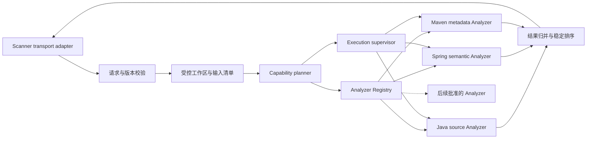
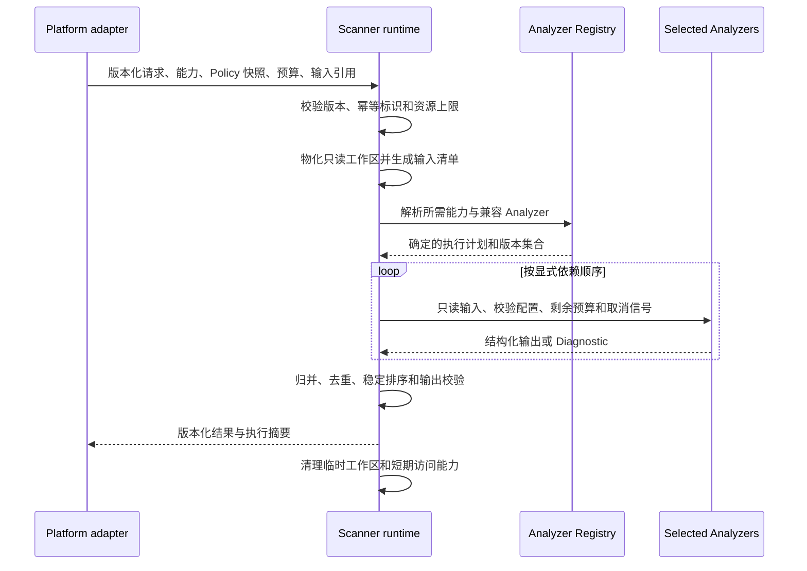

# Scanner runtime、Registry 与 Analyzer 架构

- 状态：Accepted
- 切片：D10
- 适用范围：Scanner runtime、Analyzer Registry、Analyzer 的逻辑职责、选择流程和 V1 进程边界
- 所有者：ArchGuard 项目所有者
- 依赖决策：D08 容器架构、D09 仓库边界、G1 能力地图和支持矩阵
- 最后评审：2026-09-09（G2 架构边界评审通过）
- 取代/被取代：无

## 本文解决的问题

本文定义 Scanner 如何发现受信任 Analyzer、选择已声明能力、执行受控分析并归并部分结果。它不冻结公共扫描字段、Rule Executor 最终归属、解析库、插件 ABI 或安全阈值。

## 当前事实

- 当前没有 Scanner 工程骨架、Analyzer、Registry、公共 Schema 或黄金测试。
- V1 必选分析范围是 Java 源码、Spring 语义和只读 Maven 静态元数据；JVM 字节码和 Gradle 为增强项。
- Analyzer 是声明能力并产生 Fact、Finding 或 Diagnostic 的分析单元；Scanner 是协调 Analyzer 的运行时边界。
- V1 不执行目标 Repository 的构建、脚本、插件、任务或任意命令。
- G3 尚未决定 Rule 执行所有权、结果字段、部分成功语义和不可信 Repository 安全默认值。

## 逻辑组件

## 组件职责

| 组件 | 负责 | 不负责 |
|---|---|---|
| Transport adapter | 把私有进程协议映射为 Scanner 应用请求，传播取消和 trace 上下文 | 业务授权、Analyzer 选择逻辑、保存 Platform 状态 |
| 请求与版本校验 | 校验契约版本、结构、必需能力和全局预算 | 信任 Platform 内部类型、自动纠正未知配置 |
| 受控工作区 | 获取或接收已授权输入，规范化根路径，生成不可变输入清单并负责清理 | 执行构建、解析业务规则、向 Analyzer 暴露凭据 |
| Capability planner | 把请求能力映射为明确 Analyzer 集合和依赖顺序 | 按文件内容动态下载代码、绕过 Registry |
| Analyzer Registry | 保存随 Scanner 制品发布的 Analyzer 描述与工厂映射 | 作为独立服务、业务数据库、远程插件市场或 Repository 可写目录 |
| Execution supervisor | 设置截止时间、取消、并发、内存/输出预算并隔离 Analyzer 故障 | 吞掉异常、无界重试、把 Diagnostic 改写为 Finding |
| Analyzer | 对声明的输入和配置执行确定性抽取或分析，返回结构化输出 | 网络访问、业务持久化、用户授权、加载其他 Analyzer |
| 结果归并器 | 合并输出、标注来源与版本、去重、稳定排序并形成总体结果 | 发明缺失事实、用 LLM 裁决冲突、持久化业务记录 |

## Analyzer 能力声明

每个随制品发布的 Analyzer 必须提供机器可校验的描述；D11 冻结具体字段前，G2 只要求以下语义：

| 声明项 | 用途 | 约束 |
|---|---|---|
| 稳定身份 | 在结果、配置、日志和兼容矩阵中定位 Analyzer | 不使用实现类名作为公共身份 |
| 实现版本 | 关联行为、制品和黄金结果 | 与 Scanner 契约版本分开演进 |
| 输入类型与版本范围 | 判断是否能处理当前输入 | 未声明即不执行，不用“尽力猜测”冒充支持 |
| 提供的 Capability | 供 planner 做显式选择 | 只声明有自动化验收证据的能力 |
| 配置 Schema/版本 | 在执行前拒绝未知或非法配置 | 不接受任意反射参数或脚本 |
| 输出类别 | 声明可能产生 Fact、Finding、Evidence、Diagnostic 或统计 | 具体字段和 Rule 归属由 G3 决定 |
| 资源与权限需求 | 供 runtime 应用预算和隔离 | V1 Analyzer 默认无网络、无凭据、只读工作区 |
| 依赖能力 | 表达 Spring 语义对 Java Fact 等显式前置 | 禁止通过调用另一个 Analyzer 内部类形成隐藏依赖 |

Registry 启动时校验身份唯一性、声明结构、能力依赖无环和实现可用性。无效项导致对应能力不可用并产生可定位启动/能力诊断，不能静默覆盖同名 Analyzer。

## V1 Registry 选择

- Registry 是 `archguard-scanner` 内的运行时组件，不是 Platform 模块、独立仓库、独立数据库或网络服务。
- V1 Analyzer 在构建期或启动期通过显式 allowlist 注册，代码和声明随受控 Scanner 制品发布。
- 目标 Repository、请求参数或外部 URL 不能提供可执行 Analyzer、类路径、插件目录或下载地址。
- Platform 可以通过版本化能力摘要判断某部署是否满足请求，但不能提交实现类名或绕过 Registry 的执行指令。
- 多个 Analyzer 提供相同 Capability 时，Registry 按已配置且可审计的确定策略选择；首个策略和冲突错误由 M4 设计冻结。
- 动态第三方插件系统不是 V1 目标。只有真实扩展需求、签名与供应链方案、进程隔离和兼容证据齐备后，才通过新 ADR 评估。

## Analyzer 组合边界

V1 可以把 Java、Spring 和 Maven 作为独立逻辑 Analyzer 或一个 Analyzer 内的明确能力模块；无论代码粒度如何，都必须遵守以下外部不变量：

- 每项能力有稳定身份、版本、支持范围和独立验收证据。
- 能力依赖由 planner 可见，例如 Spring 语义可以显式消费规范化 Java Fact，但不能读取 Java Analyzer 私有 AST 对象作为跨能力公共契约。
- 共享解析缓存只能属于一次 Scan 的 Scanner runtime 内部实现，不能成为 Platform 或其他仓库依赖。
- 一个能力失败时，runtime 保留已完成且契约允许的结果，并明确标识缺失能力；精确总体状态由 D11–D12 定义。
- 结果中的每项 Fact、Finding、Evidence 和 Diagnostic 必须能追踪到 Analyzer 身份、实现版本和输入版本。

## 核心执行流程

“Policy 快照”只表示请求携带不可变的规则配置语义，不提前决定 Rule Executor 位于 runtime 还是 Analyzer。Scanner 不在执行期间回读 Platform 可变业务状态。

## 失败和部分结果流程

| 场景 | Scanner runtime 行为 | 不允许的行为 |
|---|---|---|
| 契约版本或请求非法 | 在物化源码前拒绝并返回结构化失败 | 猜测字段、降级到不兼容版本 |
| 请求能力不可用 | 返回缺失能力及可用版本诊断 | 换用未声明 Analyzer 或把能力标为已完成 |
| 输入无法读取或越界 | 停止相关执行、清理工作区、返回输入 Diagnostic | 路径逃逸、扩大网络范围、执行目标脚本 |
| 单个 Analyzer 解析失败 | 保留允许的独立输出并记录来源明确的 Diagnostic | 把解析失败转成架构 Finding |
| Analyzer 超时、取消或超限 | supervisor 终止后续工作并标注未完成能力 | 忽略取消、后台泄漏线程、返回“成功” |
| Analyzer 内部异常 | 捕获到 runtime 边界、保留 cause 摘要和 trace 关联 | 吞掉异常、输出栈中的源码或凭据 |
| 输出不符合 Schema | 拒绝不合规部分并把它视为执行失败 | 让 Platform 持久化未经校验的任意对象 |
| 清理失败 | 返回/记录可操作安全事件并触发有界补偿 | 静默遗留源码且把任务标为完全成功 |

总体状态、哪些错误允许部分成功以及重试是否重复已完成 Analyzer，由 D11–D12 用契约和测试冻结。

## 进程与隔离选择

| 选项 | G2 结论 | 取舍 |
|---|---|---|
| Analyzer 作为 Platform 内模块 | 拒绝 | 混合业务和不可信输入边界，破坏独立契约与资源隔离 |
| V1 Analyzer 与 Scanner runtime 同进程 | 采用 | 受信任代码、无目标代码执行，最小化协议和运维复杂度；故障隔离较弱 |
| 每个 Analyzer 独立服务 | 暂不采用 | 版本、网络、部署和部分失败成本高，当前没有团队或容量证据 |
| Scanner 启动受控子进程 | 保留演进点 | 适合未来原生工具、不同语言运行时或更强隔离，但须补充协议、资源回收和供应链 ADR |
| Repository 提供动态插件 | 拒绝 | 直接把不可信输入升级为代码执行，违背 V1 安全边界 |

同进程不代表没有逻辑边界：Analyzer 只通过 Scanner 定义的接口、不可变上下文和结构化输出协作，不获得 transport、Registry、凭据或 Platform adapter。

## 可观测与可重复性边界

- 每次 Scan 记录 traceId、Scanner 版本、契约版本、Analyzer 身份/版本、输入不可变标识、配置摘要、状态、耗时和资源摘要。
- 日志不记录 Token、完整源码、未经最小化的 AST 或隐藏推理；Evidence 是否包含片段由 G3 决定。
- 相同不可变输入、Analyzer/Rule/配置版本和资源条件应产生稳定排序的同语义结果。
- 时间、随机数、文件遍历顺序、Locale 和外部网络不得成为未声明的结果变量。
- Analyzer 能力升级必须用 `archguard-samples` 黄金用例证明正常、违规、失败和边界行为。

## 兼容与扩展顺序

1. Docs 接受能力语义与必要 ADR。
2. Samples 增加合成输入、预期结果和版本元数据。
3. Scanner 先扩展能力声明和 Registry 校验，再实现 Analyzer 与黄金测试。
4. Scanner 发布兼容制品和能力摘要；Platform 只在确认目标部署满足能力后启用请求。
5. Deploy 更新验证过的 Scanner/Platform 组合；Evals 在能力进入 AI 或工具场景前增加回归。

回滚时 Platform 先停止请求新能力并切回共同契约版本，再回滚 Scanner 制品；Registry 不保留业务数据，因此不需要数据迁移回滚。

## 已接受决策

- Scanner runtime 是 Analyzer 的唯一编排和资源治理边界。
- Analyzer Registry 属于 Scanner 进程，V1 使用随制品发布的显式 allowlist。
- V1 Analyzer 作为受信任模块与 Scanner 同进程，目标 Repository 永远不能提供可执行插件。
- Analyzer 通过稳定能力声明参与选择，Platform 只表达所需能力而不指定实现类。
- 跨能力依赖通过规范化输出或 Scanner 内部显式接口表达，不泄漏私有解析对象到公共契约。

以上边界已于 2026-09-09 通过 G2 评审；公共字段、Rule 归属和隔离阈值仍由 G3 冻结。

## 非目标

- 不选择 JavaParser、ASM、ArchUnit、Spring 分析库或 Maven 解析库。
- 不冻结 Analyzer Java 接口、manifest 字段、结果 Schema 或错误码。
- 不决定 Rule Executor、Fact 对 Platform 的可见性或 Finding 去重键。
- 不实现动态插件、跨进程 Analyzer、远程 Registry 或多语言扩展。
- 不给并发、超时、内存、文件数和输出量设置未经基准验证的数值。

## 开放问题

- Java、Spring、Maven 应拆成几个代码模块和 Analyzer 身份？由 D14 Feature Spec 与 M4 Technical Design 决定。
- Rule 求值由 Scanner runtime 的通用执行器还是能力特定 Analyzer 承担？由 D12 和对应 ADR 决定。
- 部分成功的总体状态、重试粒度、结果去重和未知输出如何表达？由 D11–D12 决定。
- V1 的输入物化、文件系统隔离和操作系统资源限制如何实现？由 D13 决定。
- 首个需要子进程隔离的触发条件是什么？在原生工具或不同信任级能力出现时重新评估。

## 验收证据

- 组件图和职责表清楚区分 transport、runtime、Registry、Analyzer、工作区和结果归并。
- 能力声明覆盖稳定身份、实现版本、输入、Capability、配置、输出、权限和依赖。
- 核心/失败流程说明请求校验、能力选择、执行、部分结果、输出校验和清理责任。
- 进程选择明确 V1 同进程 Analyzer、Platform/Scanner 分离及动态 Repository 插件禁令。
- [能力地图](../product/capability-map.md)和[支持矩阵](../product/support-matrix.md)支持 V1 能力范围与当前未支持状态。
- [G2 架构边界评审](../reports/g2-architecture-boundary-review.md)接受本文的 Registry、Analyzer 和执行边界。
