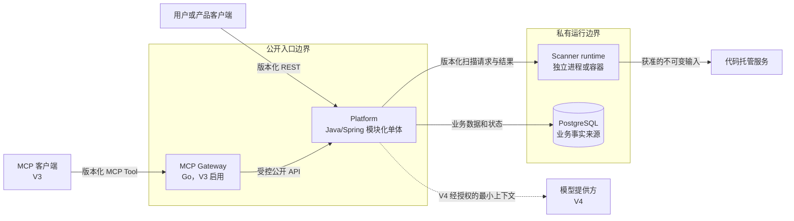
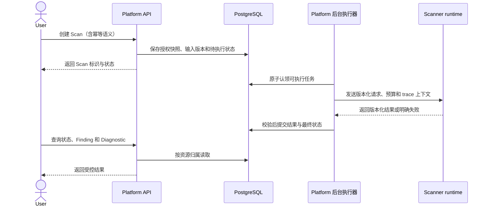

# ArchGuard 容器与进程架构

- 状态：Accepted
- 切片：D08
- 适用范围：Platform、Scanner、MCP Gateway、PostgreSQL 及其部署和进程边界
- 所有者：ArchGuard 项目所有者
- 依赖决策：D07 系统上下文、G1 产品边界和仓库治理基线
- 最后评审：2026-09-09（G2 架构边界评审通过）
- 取代/被取代：无

## 本文解决的问题

本文提出目标容器、进程所有权、允许的数据访问和按版本启用顺序，供 G2 冻结“谁负责什么”的边界；传输协议、字段级 Schema、队列产品、部署副本数和容量阈值仍留给后续设计。

## 当前事实

- 所有运行时仓库仍只有 M0 基线，没有可启动进程、数据库迁移或网络协议。
- Platform 已被约束为 Java/Spring 模块化单体，PostgreSQL 是业务事实来源。
- M3 先用 Fake Scanner 验证业务流程，M4 建立真实 Scanner，M5 才完成跨进程集成。
- M7 只在可靠性证据要求时演进消息机制；当前没有引入 Kafka 或 Redis 的依据。
- Gateway、模型调用和相关 Evals 分别服务 V3、V4，不是 V1 运行前提。

## 目标容器图

公开入口表示可以被部署为受控外部入口，不表示必须直接暴露进程端口。生产流量仍应经过 TLS、身份校验、限流和适用的边缘控制。Scanner 与 PostgreSQL 只位于私有网络。

## 容器职责

| 容器 | 主要职责 | 持久状态 | 禁止职责 |
|---|---|---|---|
| Platform | 身份与资源归属、Project/Repository/Policy、Scan 状态机、编排、结果查询和审计 | 通过 PostgreSQL 保存业务事实 | 解析源码、加载 Analyzer、跨模块直接写表、把内部实体作为公共契约 |
| Platform 后台执行器 | 从 Platform 持久任务中认领工作、调用 Scanner adapter、处理重试/取消/结果提交 | 任务状态仍由 Platform 应用层和 PostgreSQL 管理 | 形成第二套任务事实、无限重试、绕过事务和幂等边界 |
| Scanner runtime | 校验扫描输入、选择 Analyzer、物化受控工作区、执行资源限制、归并结果和清理 | 默认无业务持久状态；只允许有界临时文件 | 访问 Platform 表、管理用户或 Project、持有长期 Repository 凭据 |
| PostgreSQL | 保存 Platform 业务事实、迁移和必要审计 | 持久 | 被 Scanner、Gateway 或外部客户端直连 |
| MCP Gateway | V3 工具发现、身份传播、授权前置、Schema 校验、限流、超时和审计关联 | 最小可重建配置；业务事实仍在 Platform | 直连数据库、执行分析或任意 Shell、默认写业务资源 |
| 模型适配器 | V4 组装最小上下文、调用提供方并校验输出 | Prompt/模型版本和必要审计摘要 | 生成确定性 Fact/Finding、绕过资源授权、记录隐藏推理 |

“Platform 后台执行器”是模块化单体内的应用/基础设施适配器，可以与 API 同进程或作为同一制品的独立运行模式；它不是新领域服务，也不拥有独立数据库。

## 进程与部署边界

| 边界 | G2 提案 | 原因 | 允许的后续演进 |
|---|---|---|---|
| Platform 模块 | 同一模块化单体制品，模块通过公开应用接口或领域/应用事件协作 | 保持事务和部署简单，避免无证据拆分微服务 | 只有容量、团队或隔离证据成立并有 ADR 时才拆分 |
| Platform 与 Scanner | 不同 OS 进程和部署单元，只通过版本化 Scanner 契约交互 | 隔离不可信输入与资源消耗，允许独立发布和扩缩 | 传输适配器可替换，但 Platform 领域模型与 Scanner 实现不得耦合 |
| Scanner 与 V1 Analyzer | 同一 Scanner 进程内的受信任、随制品发布的模块 | V1 不执行目标代码，进程间插件复杂度没有收益证据 | 新语言、原生工具或不同信任级别可经 ADR 改为受控子进程 |
| Gateway 与 Platform | 独立进程；Gateway 只调用公开、受授权的 API | 隔离外部工具协议和 Go 生命周期，不复制业务授权 | 可增加窄的 Scanner 能力查询，但不得访问 Project 数据或数据库 |
| Platform 与 PostgreSQL | 仅 Platform 基础设施适配器连接数据库 | 保持业务事实与授权边界唯一 | 只读副本或缓存须有一致性和数据分类设计 |

## Platform 模块化单体边界

初始模块候选为 `identity`、`project`、`repository`、`policy`、`scan`、`result`、`architecture` 和 `audit`。模块名可在 M2 Technical Design 中调整，但必须保持以下规则：

- 每个模块拥有自己的领域模型、应用用例和持久化映射。
- 跨模块调用只通过公开应用接口或显式事件，不读取其他模块内部类或表。
- 事务边界位于应用层；跨模块一致性优先采用同库事务或可追踪的应用事件，不因模块化而引入分布式事务。
- REST、后台执行器和持久化是适配器，领域层不依赖 Spring Web、数据库驱动或 Scanner SDK 实现。
- Scanner adapter 是 `scan` 应用边界的输出 Port；M3 Fake 和 M5 真实适配器实现同一语义。

## 扫描编排边界

- Platform 必须先持久化任务再执行；用户请求不持有完整扫描生命周期。
- 初期可靠任务来源是 PostgreSQL 中的业务任务记录。队列、Outbox 或 Broker 的选择由 M3/M5 设计和 M7 证据决定。
- Scanner 的一次调用必须有幂等标识、超时、取消和输出上限；准确字段由 D11 冻结。
- Platform 只接受通过版本、Schema、业务归属和状态机校验的结果。

## 网络与存储访问矩阵

| 发起方 | 目标 | 默认 | 约束 |
|---|---|---|---|
| 外部客户端 | Platform 入口 | 允许 | TLS、认证、授权、输入限制、限流和审计 |
| MCP 客户端 | Gateway 入口 | V3 允许 | 工具白名单、Schema、身份传播、超时和默认只读 |
| Gateway | Platform API | 允许的窄路径 | 不能使用服务身份替代最终用户的资源授权 |
| Platform | PostgreSQL | 允许 | 仅模块拥有的映射；Flyway 迁移；最小数据库权限 |
| Platform 后台执行器 | Scanner 私有接口 | 允许 | 版本化契约、服务身份、超时、取消、重试预算 |
| Scanner | 受控输入来源 | 按任务允许 | 只访问获准不可变版本；凭据短期化；禁止任意网络发现 |
| Scanner | PostgreSQL | 禁止 | 结果必须经过 Platform 应用边界 |
| Analyzer | 外部网络或业务服务 | 默认禁止 | 未来例外需能力声明、安全评审和技术控制 |
| 公网 | Scanner、PostgreSQL、内部管理端口 | 禁止 | 仅私有网络和受控健康探针可达 |

## 版本启用顺序

| 阶段 | 启用内容 | 不启用内容 |
|---|---|---|
| M2 | Platform 模块骨架、健康检查和公开应用边界 | 真实扫描、Gateway、模型调用 |
| M3 | Platform 持久任务、状态机和 Fake Scanner adapter | 真实 Analyzer、外部消息 Broker |
| M4 | 独立 Scanner 制品、Registry 和 V1 Analyzer | Platform 真实跨进程集成 |
| M5 | Platform 与 Scanner 的私有跨进程集成、清理和端到端证据 | 无证据的 Kafka/Redis 引入 |
| M7 | 根据队列、吞吐和故障证据演进可靠性机制 | 为展示而拆分 Platform 模块 |
| M8/V3 | 独立 Gateway 与只读工具 | 数据库直连或默认写工具 |
| M10/V4 | 经授权的 AI 解释适配器 | 用 LLM 替代确定性分析 |

## 兼容、发布与回滚

- G2 文档先合并；D11 冻结首个开发期 Scanner 契约后，Scanner 提供方先实现兼容版本，Platform 消费方后启用。
- Scanner 和 Platform 在滚动升级窗口内至少共享一个受支持契约版本；不兼容变化按开发期语义化版本提升次版本。
- Gateway 只能依赖已发布的 Platform API；Deploy 最后更新制品组合与兼容矩阵。
- 数据库迁移采用 Expand/Contract；Scanner 和 Gateway 不参与 Platform Schema 迁移。
- 回滚顺序为入口/消费方 → Platform 调用适配器 → Scanner 提供方；数据库只回滚应用，不修改已发布迁移。

本文不引入运行时制品或迁移，当前文档变更可以独立回滚，不影响其他仓库运行。

## 已接受决策

- V1 最小运行拓扑是 Platform、Scanner 和 PostgreSQL；Gateway、模型适配器、Redis、Broker 和 Kubernetes 均不是 V1 前提。
- Platform 与 Scanner 是独立进程；Scanner 无权访问 Platform 数据库。
- V1 Analyzer 与 Scanner runtime 同进程，但保持逻辑接口和能力声明边界。
- Platform 先写持久任务、后台执行，不让同步用户请求承担扫描生命周期。
- 只有 Platform 对业务结果执行最终 Schema、状态机和资源归属校验并持久化。

以上边界已于 2026-09-09 通过 G2 评审；传输、Schema 和容量机制仍由对应后续设计冻结。

## 非目标

- 不选择 HTTP、gRPC、命令协议、消息 Broker 或序列化库。
- 不决定副本数、CPU/内存阈值、SLA、缓存和对象存储。
- 不定义 Scanner 契约字段、状态枚举、重试次数或数据保留时长。
- 不拆分 Platform 微服务，不部署 Gateway 或模型能力。

## 开放问题

- M5 的首个 Scanner 传输适配器采用何种协议，如何验证取消和大结果？由 D11 与 M5 Technical Design 决定。
- 源码由 Scanner 直接物化还是由受控输入服务准备？V1 输入方式和 D13 安全设计共同决定。
- Platform 模块的最终名称和公开应用接口如何划分？由 M2 Technical Design 决定。
- 何种队列长度、延迟或恢复证据触发 M7 引入 Broker？由 M7 ADR 决定。

## 验收证据

- 容器图区分公开入口、私有运行边界、当前 V1 依赖和后续版本入口。
- 职责表和访问矩阵明确 PostgreSQL 只由 Platform 访问，Scanner 不暴露公网。
- 进程矩阵明确 Platform/Scanner 分离及 Scanner/Analyzer 的 V1 同进程选择。
- 扫描时序包含先持久化、异步执行、契约校验、结果提交和查询主路径。
- [系统上下文](system-context.md)提供外部信任边界，[阶段提示词](../engineering/prompts.md)提供启用顺序依据。
- [G2 架构边界评审](../reports/g2-architecture-boundary-review.md)接受本文的容器与进程边界。
