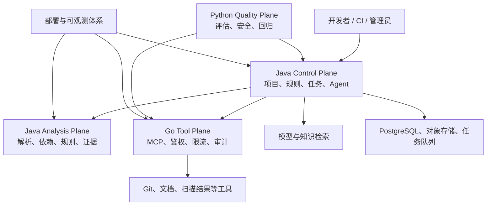

# ArchGuard 架构上下文

- 状态：Accepted
- 生效日期：2026-09-09
- 交付顺序：[ADR-0006](../adr/0006-java-first-phased-delivery.md)

## 系统关系

图描述最终边界，不表示这些组件已经交付。当前 Scanner 处于阶段 1，只有 S1 构建与模块边界；Platform 是阶段 2 预实现资产；其余平面尚未启用。

## 信任边界

- Repository、文档、Webhook、工具参数、模型输入和模型输出均不可信。
- Platform 是 Project、RuleSet、ScanJob、Finding 生命周期、权限和审计的业务入口。
- Scanner 只处理受控输入并返回版本化结果，不接触 Platform 数据库。
- Gateway 在阶段 5 接管成熟工具的通信与前置控制；Platform 仍作最终业务授权。
- Evals 只通过公开契约做黑盒评估，不在生产请求链路中。
- PostgreSQL、Scanner 和内部管理端口不暴露公网。

## 最终不变量

确定性 Scanner 提供事实；Agent 解释事实；用户决定是否处置；Gateway 控制工具访问；Evals 验证智能能力；Deploy 证明系统可运行和恢复。
