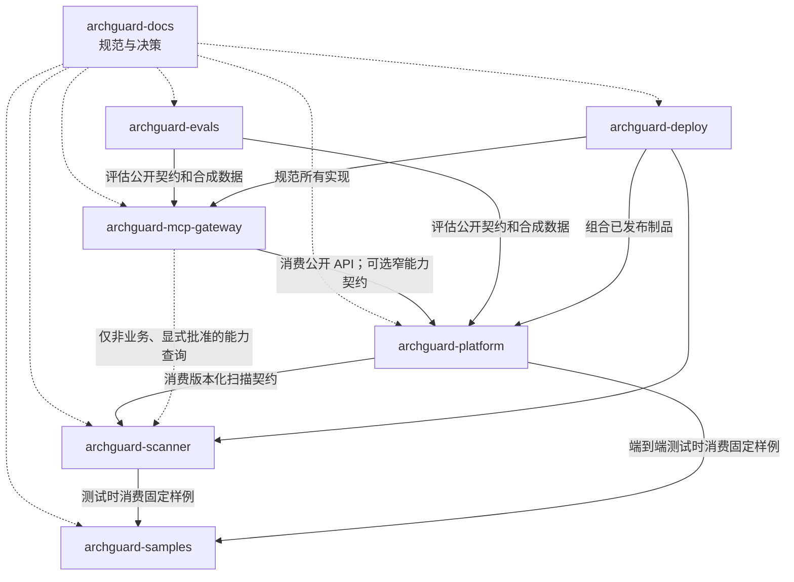

# ArchGuard 七仓库职责与依赖边界

- 状态：Accepted
- 切片：D09
- 适用范围：七个 ArchGuard 工程仓库的事实来源、依赖方向、禁止依赖和契约所有权
- 所有者：ArchGuard 项目所有者
- 依赖决策：D07 系统上下文、D08 容器架构与 M0 仓库基线
- 最后评审：2026-09-09（G2 架构边界评审通过）
- 取代/被取代：无

## 本文解决的问题

本文把仓库级 README 中的高层职责收敛为可评审的跨仓库边界，并为规范、契约、样例、评估和部署兼容信息指定唯一所有者。它不定义仓库内部包结构、契约字段或发布版本号。

## 当前事实

- 七个仓库均已独立初始化并拥有自己的 `main`、CI 和发布历史。
- 当前没有业务代码、可发布 Scanner 契约、合成样例或部署制品。
- `archguard-docs` 是跨仓库规范事实来源；各实现仓库 README 只描述与实现紧密相关的入口和限制。
- 七仓库不要求同版本发布，跨仓库兼容组合最终由 `archguard-deploy` 记录。

## 职责矩阵

| 仓库 | 唯一主责 | 必须产出的证据 | 明确非职责 |
|---|---|---|---|
| `archguard-docs` | 产品、需求、总体架构、ADR、工程规范和跨仓库语义 | Accepted Spec/ADR、追踪矩阵、评审和交付报告 | 业务实现、运行时库、部署制品 |
| `archguard-platform` | 模块化单体业务控制面、授权、扫描编排、业务事实和公开 REST API | OpenAPI、迁移、模块/权限/状态机测试、审计证据 | 源码解析、Analyzer Registry、MCP 协议治理 |
| `archguard-scanner` | 受控扫描运行时、Analyzer Registry、确定性分析及 Scanner 契约制品 | 版本化 Schema/SDK 或等价制品、黄金测试、资源与失败测试 | 用户/Project 管理、业务数据库、外部产品入口 |
| `archguard-mcp-gateway` | V3 MCP 工具目录、身份传播、路由、限流、超时和工具审计 | Tool Schema、授权/越权/取消测试、Go 并发与安全证据 | 业务事实、源码分析、数据库直连、任意 Shell |
| `archguard-samples` | 可公开、合成、固定版本的正常/违规/失败输入 | 样例说明、预期结果、适用契约版本和可重复命令 | 生产业务、真实客户源码、Scanner 规则实现 |
| `archguard-evals` | 与模型/Agent 框架解耦的评估集、评分器和候选对比 | 数据集版本、评分定义、安全用例、基线报告 | 生产推理、确定性 Rule、通过放宽样例制造成功 |
| `archguard-deploy` | 环境编排、制品兼容矩阵、配置、可观测、备份与回滚 | Compose/部署清单、版本组合、健康/恢复/回滚证据 | 业务或 Analyzer 实现、Secret 和真实数据存储 |

## 依赖方向

虚线 `Docs → 实现仓库` 表示规范性依赖，不是构建或运行时导入。箭头指向被消费的事实或制品所有者，不表示被依赖仓库可以反向访问消费方内部实现。

## 允许依赖

| 消费方 | 提供方 | 允许的边界 | 条件 |
|---|---|---|---|
| Platform | Scanner | 版本化 Scan Request/Result、能力描述和测试夹具接口 | 只依赖公开制品，不依赖内部类、表或部署路径 |
| Gateway | Platform | 版本化 REST/查询 API | 传播最终用户身份和 Project 范围，由 Platform 做最终业务授权 |
| Gateway | Scanner | 无业务状态的能力元数据或后续批准的窄公开 API | 默认不需要；不得查询 Project 数据、提交绕过 Platform 的 Scan 或读取临时工作区 |
| Scanner/Platform | Samples | 固定版本或提交的合成输入和预期结果 | 测试依赖，不把 Samples 打包为生产逻辑 |
| Evals | Platform/Gateway/Scanner | 公开契约、黑盒端点、合成数据和可脱敏报告 | 不引用内部类，不携带真实客户数据 |
| Deploy | Platform/Scanner/Gateway | 已发布镜像、健康契约、配置说明和兼容元数据 | 不从源码内部结构推导运行配置 |
| 所有仓库 | Docs | 产品范围、架构、ADR、规范和报告链接 | 不复制后独立演进同一规范事实 |

## 禁止依赖

- Platform 不导入 Scanner 实现包，不读取 Scanner 临时工作区，也不把 JPA 实体传入扫描契约。
- Scanner 不连接 Platform 数据库，不调用 Platform 内部接口，不管理用户、Project、Policy 生命周期或审计事实。
- Analyzer 不依赖 Platform、Gateway、Deploy 或业务数据库；Analyzer 间不通过对方内部类隐式耦合。
- Gateway 不直连 PostgreSQL，不读取 Scanner 文件系统，不持有绕过最终用户授权的万能服务身份。
- Samples 和 Evals 不成为生产服务的运行时依赖。
- Deploy 不复制应用业务配置默认值为第二事实来源；参数语义由提供方仓库说明，环境组合由 Deploy 记录。
- Docs 不发布供运行时导入的共享“万能模型”包；契约制品由其实现所有者维护，Docs 记录规范语义。
- 任何仓库不得通过 Git submodule、源码复制或内部包引用规避版本化公共边界。

## 契约与事实所有权

| 边界或事实 | 规范语义所有者 | 可执行制品所有者 | 消费方 | 兼容证据所有者 |
|---|---|---|---|---|
| 产品术语、能力状态和版本范围 | Docs | 不适用 | 全部 | Docs 评审记录 |
| 外部 REST API | Docs 记录产品语义；Platform 细化接口设计 | Platform OpenAPI | 产品客户端、Gateway | Platform 契约测试；Deploy 记录制品组合 |
| Scanner Request/Result | Docs 记录公共语义与版本原则 | Scanner Schema/SDK 或等价制品 | Platform、Evals | Scanner 提供方测试 + Platform 消费方测试 |
| Analyzer 能力描述 | Docs 记录身份、能力和兼容原则 | Scanner Registry manifest/接口 | Scanner runtime；Platform 可查询摘要 | Scanner Registry 与黄金测试 |
| MCP Tool Schema | Docs 记录权限和产品语义 | Gateway Tool Schema | MCP 客户端、Evals | Gateway 契约/授权测试 + Evals |
| 合成输入与预期结果 | 对应 Spec/Docs 定义验收语义 | Samples 文件与元数据 | Scanner、Platform、Evals | Samples 验证 + 消费仓库黄金/端到端测试 |
| AI 评估定义和基线 | Docs 记录产品门槛 | Evals 数据集、评分器和报告格式 | Platform/Gateway/模型适配器 | Evals 回归报告 |
| 部署兼容矩阵 | Docs 记录发布原则 | Deploy 版本矩阵和环境清单 | 运维与发布流程 | Deploy 配置、健康、备份和回滚验证 |

Docs 对“语义”的所有权不允许它单方面修改提供方制品。跨仓库契约变化必须同时更新规范、提供方制品、消费方测试和 Deploy 兼容记录。

## 变更与兼容流程

1. 在 Docs 的 Feature Spec/Technical Design/ADR 中说明问题、兼容范围和迁移顺序。
2. 提供方先发布能与旧消费方共存的契约或实现；破坏性开发期变化提升 `0.x` 次版本。
3. Samples 提供同时覆盖旧/新语义的合成证据，适用时 Evals 更新基线但不删除旧失败样例。
4. 消费方升级并运行双方契约测试；在兼容窗口结束前不移除旧路径。
5. Deploy 最后把验证过的制品组合加入兼容矩阵，再按入口到内部提供方的顺序发布。
6. 清理旧契约前确认无受支持消费方并新增变更记录；已发布数据库迁移不得改写。

## 发布与回滚顺序

| 变化 | 发布顺序 | 回滚顺序 | 关键保护 |
|---|---|---|---|
| Scanner 向后兼容扩展 | Docs/Samples → Scanner → Platform → Deploy | Platform → Scanner；Docs 最后 | 旧 Platform 必须能忽略新可选内容 |
| Scanner 破坏性开发期变更 | Docs/新版本 → Scanner 并行版本 → Platform 切换 → Deploy | Platform 切回旧契约 → Scanner 旧版本 | 同一部署窗口至少保留一个共同版本 |
| Platform REST 扩展 | Docs → Platform → Gateway/Evals → Deploy | Gateway/客户端 → Platform | 先增加后移除，OpenAPI 契约测试 |
| MCP Tool 变化 | Docs → Platform 依赖能力 → Gateway → Evals/Deploy | Gateway → Platform | 默认只读、未知参数拒绝、工具版本可定位 |
| 部署配置变化 | 提供方说明 → Deploy | Deploy 回到上一验证组合 | Secret 分离、健康检查和备份证据 |

G2 当前只修改 Docs，没有运行时契约或制品变化；回滚本分支不会要求其他仓库按顺序操作。

## 已接受决策

- 七仓库继续独立版本和发布，不建立共享单体源码仓库或跨仓“common”内部模型。
- Scanner 拥有扫描和 Analyzer 公共制品，Platform 只作为消费者参与评审和兼容测试。
- Gateway 的业务查询默认经 Platform；直达 Scanner 仅限无 Project 业务状态的窄公开能力，并须单独批准。
- Samples 与 Evals 只作为测试/评估输入，Deploy 只组合已发布制品。
- Docs 保存规范语义和评审证据，Deploy 保存已验证的运行制品兼容组合。

以上边界已于 2026-09-09 通过 G2 评审；契约制品格式和首个版本仍由 G3 冻结。

## 非目标

- 不规定 Java package、Go package、Gradle/Maven module 或代码所有者。
- 不创建共享 SDK、Schema、样例、镜像或发布流水线。
- 不指定七仓库统一版本，不承诺同步发布。
- 不冻结字段级兼容规则、制品仓库或依赖管理工具。

## 开放问题

- Scanner 契约以 JSON Schema、OpenAPI、Protobuf 还是其他形式发布？由 D11 和 M4 Technical Design 决定。
- 是否需要独立的契约制品仓库？当前答案为否，只有多提供方或发布治理证据出现时重新评估。
- Gateway 是否存在不经过 Platform 的实际 V3 用例？由 V3 Feature Spec 决定；没有证据时不开放。
- Deploy 兼容矩阵的机器可读格式和制品签名要求是什么？由 M11 决定。

## 验收证据

- 职责矩阵逐一覆盖七个仓库并给出唯一主责、证据和非职责。
- 依赖图、允许表和禁止清单能判断每条候选跨仓引用是否合法。
- 契约所有权表区分规范语义、可执行制品、消费方和兼容证据。
- 发布与回滚表覆盖 Scanner、REST、MCP 和部署变化，不假设七仓同版本。
- 七仓库 README 的职责与本文一致；本文进一步收窄了 Gateway 对业务数据的访问路径。
- [G2 架构边界评审](../reports/g2-architecture-boundary-review.md)接受本文的仓库依赖和所有权边界。
