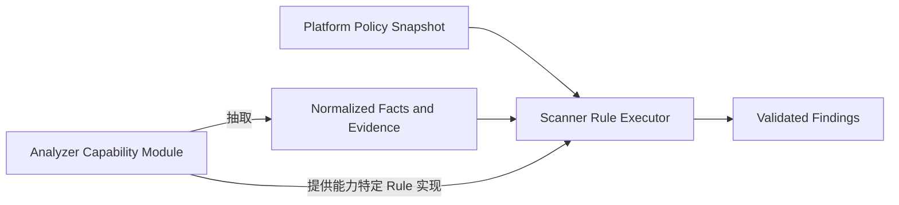

# 结果与 Rule 模型

- 状态：Accepted
- 切片：D12
- 适用范围：Fact、Finding、Evidence、Diagnostic、Rule、Policy 及其身份、引用和执行职责
- 所有者：`archguard-docs` 维护语义，`archguard-scanner` 发布机器 Schema 和确定性实现
- 依赖决策：D02 术语、D10 Analyzer 架构、D11 Scanner 契约
- 最后评审：2026-09-09（G3 契约与安全评审通过）
- 取代/被取代：无

## 本文解决的问题

本文冻结跨 Scanner 边界的结果项字段、确定性身份和 Rule 执行职责，避免 Fact、Finding、Evidence 与 Diagnostic 混用。具体 Java/Spring/Maven Fact kind、Rule 清单和支持版本由 D14 定义。

## 当前事实

- 当前没有结果 Schema、Rule 实现、Policy 数据库模型或黄金样例。
- G1 已接受 Fact 是观察结果、Finding 是 Rule 结论、Diagnostic 是执行问题、Evidence 是最小依据。
- G2 已接受 Scanner runtime 统一编排，Analyzer 通过稳定 Capability 参与执行。
- LLM 输出不能成为 Fact、确定性 Finding 或合并门禁的事实来源。

## 公共引用类型

| 类型 | 必需字段 | 语义 |
|---|---|---|
| `ProducerRef` | `analyzerId`、`analyzerVersion`、`capabilityId` | 标识产生 Fact/Evidence/Diagnostic 或提供 Rule 的已发布 Analyzer 能力 |
| `EntityRef` | `kind`、`qualifiedName` | 语言/领域无关的影响对象；kind-specific Schema 可增加严格字段，但不能放任任意属性 |
| `SourceRange` | `startLine`、`startColumn`、`endLine`、`endColumn` | 1-based，结束位置 exclusive；必须位于同一规范相对路径 |
| `RuleRef` | `ruleId`、`ruleVersion` | Rule ID 稳定，版本使用 SemVer；结果必须记录精确版本 |

所有公共 ID 使用小写 ASCII 命名空间，例如 `java.type-dependency`、`spring.bean-dependency`、`archguard.forbidden-dependency`。实现类名、包名和数据库键不能作为公共 ID。

## Evidence

| 字段 | 类型 | 必需 | 语义与约束 |
|---|---|---:|---|
| `evidenceId` | `sha256:<hex>` | 是 | 对规范身份字段计算的稳定 ID |
| `kind` | 字符串 | 是 | 例如 `source-location`、`symbol`、`dependency-edge`、`config-entry`；每种 kind 有严格子 Schema |
| `path` | 规范相对路径 | 条件 | 需要文件定位时必需；不得包含绝对路径或输入根之外信息 |
| `range` | `SourceRange` | 否 | 只在解析器能可靠定位时提供，不用 `0` 或负数表示未知 |
| `symbol` | 字符串 | 否 | 规范限定名，不保存任意源码文本 |
| `fingerprint` | `sha256:<hex>` | 是 | 证据内容/语义摘要，用于验证而不是还原源码 |
| `producer` | `ProducerRef` | 是 | 可追踪到 Analyzer 能力和版本 |

`0.1.0` 不提供源码 excerpt 字段。需要展示上下文时，Platform 在用户授权下通过 Repository 读取对应不可变 revision；Evidence 本身只保存路径、位置、符号和摘要。

## Fact

| 字段 | 类型 | 必需 | 语义与约束 |
|---|---|---:|---|
| `factId` | `sha256:<hex>` | 是 | 同一规范 Fact 内容得到同一 ID |
| `kind` | 字符串 | 是 | 稳定 Fact kind，必须有版本化 kind-specific Schema |
| `subject` | `EntityRef` | 是 | Fact 的主对象 |
| `object` | `EntityRef` | 否 | 二元关系的目标；一元 Fact 不提供 |
| `data` | 对象 | 是 | 由 `kind` 对应 Schema 严格校验，不允许未声明属性 |
| `evidenceIds` | 非空 ID 数组 | 是 | 去重、排序，必须解析到本结果 Evidence |
| `producer` | `ProducerRef` | 是 | 产生该 Fact 的 Analyzer 能力 |

- Fact 只陈述可重复观察，不包含 severity、合规状态、修复建议或 LLM 置信度。
- Analyzer 私有 AST、完整依赖图缓存和中间对象不是公共 Fact。
- Scanner 只导出被 Finding 引用的 Fact，或由请求 Capability 明确要求的可公开 Fact；Platform V1 必须持久化 Finding 引用的 Fact，可按产品需求丢弃其他导出 Fact。

## Finding

| 字段 | 类型 | 必需 | 语义与约束 |
|---|---|---:|---|
| `findingId` | `sha256:<hex>` | 是 | 当前输入 revision 上的确定性结果身份 |
| `fingerprint` | `sha256:<hex>` | 是 | 跨 revision 关联键，不包含行号、显示文本或 severity |
| `rule` | `RuleRef` | 是 | 产生结论的精确 Rule 及版本 |
| `severity` | 枚举 | 是 | `INFO`、`WARNING`、`ERROR`、`CRITICAL`；Policy 可在 Rule 允许范围内覆盖 |
| `subject` | `EntityRef` | 是 | 受 Finding 影响的主要对象 |
| `relatedFactIds` | 非空 ID 数组 | 是 | 支撑判定的 Fact，必须引用闭合 |
| `evidenceIds` | 非空 ID 数组 | 是 | 用户可验证的最小 Evidence，必须引用闭合 |
| `message` | 字符串 | 是 | 确定性模板渲染的安全说明；不参与 fingerprint |
| `producer` | `ProducerRef` | 是 | 提供 Rule 实现的 Analyzer 能力 |

- Finding 只表示 Rule 被违反；通过的 Rule 不生成“pass Finding”，其数量进入统计。
- `Violation` 不作为 `0.1.0` 字段、类型或兼容别名。外部产品统一使用 Finding。
- Scanner 不写 `open/resolved/ignored` 等业务生命周期；Platform 以 fingerprint 关联跨 Scan 状态和人工处置。
- 修复建议不是确定性身份的一部分；V1 可以由固定 Rule 元数据提供文档链接，但不包含 AI 建议。

## Diagnostic

| 字段 | 类型 | 必需 | 语义与约束 |
|---|---|---:|---|
| `diagnosticId` | `sha256:<hex>` | 是 | 基于 code、scope、位置、能力和 Analyzer 的稳定身份 |
| `code` | 点分错误码 | 是 | 来自版本化目录，不把异常类名作为公共 code |
| `level` | 枚举 | 是 | `INFO`、`WARNING` 或 `ERROR` |
| `scope` | 枚举 | 是 | `CONTRACT`、`INPUT`、`CAPABILITY`、`ANALYZER`、`RULE`、`OUTPUT`、`SECURITY`、`CLEANUP` |
| `message` | 字符串 | 是 | 已清理的可操作摘要，不含凭据、完整源码、堆栈或主机绝对路径 |
| `retryable` | 布尔值 | 是 | 由错误码目录给出默认值，不能由异常临时猜测 |
| `path` / `range` | 位置 | 否 | 仅在安全且可靠时提供 |
| `capabilityId` / `analyzer` | 引用 | 否 | 适用时定位受影响能力和实现 |
| `evidenceIds` | ID 数组 | 是 | 可以为空；非空时必须引用闭合并排序 |

Diagnostic 永远不是 Finding。解析失败、超时、取消、超限、安全拒绝和清理失败不能通过伪造 Rule 变成架构违规。

## Rule 描述与 Policy 快照

每个已发布 Rule 描述包含：

| 字段 | 语义 |
|---|---|
| `ruleId` / `ruleVersion` | 稳定身份和精确实现语义版本 |
| `capabilityId` | 提供实现的 Analyzer 能力 |
| `requiredFactKinds` | Rule 可读取的版本化 Fact kind |
| `parameterSchema` | 严格 JSON Schema；未知参数拒绝 |
| `defaultSeverity` / `allowedSeverities` | 默认和 Policy 可覆盖范围 |
| `documentationRef` | 指向 Docs/Scanner 中无凭据的规则说明 |

Platform 管理 Policy 生命周期、作用域、启用状态、参数和 severity，并在创建 Scan 时生成不可变 `PolicySnapshot`。Scanner 只验证并执行快照，不回读 Platform，也不保存 Policy 业务状态。

## Rule 执行职责

- Scanner runtime 拥有统一 Rule Executor：快照校验、依赖计划、生命周期、预算、统计、稳定排序和最终 Finding Schema 校验。
- Analyzer 能力模块拥有语言/框架 Fact 抽取器和能力特定的确定性 Rule 实现，通过 Registry 显式注册。
- 通用 Rule 可以由 Scanner 核心模块提供，但仍使用相同描述、版本和执行接口。
- Rule 实现只读取声明的规范 Fact，不访问 Platform、网络、凭据、原始任意路径或其他 Analyzer 私有对象。
- LLM 可以在 V4 解释已验证 Finding，但不能注册 Rule、生成 Fact 或改变 severity/门禁。

## 确定性身份

- Evidence、Fact、Finding 和 Diagnostic ID 使用 RFC 8785 规范 JSON 的 SHA-256，格式 `sha256:<64 lowercase hex>`。
- `evidenceId` 包含 kind、规范路径/位置、symbol、fingerprint 和 producer。
- `factId` 包含 kind、subject、object、data、evidenceIds 和 producer。
- `findingId` 包含输入 revision、RuleRef、subject、relatedFactIds、evidenceIds 和 producer。
- Finding `fingerprint` 只包含 Rule ID、subject 稳定身份和不含行号的证据语义键；不包含 revision、message、severity 或 Rule patch 版本。
- `diagnosticId` 包含 code、scope、安全位置、capability/analyzer；不包含易变 message 和时间。

相同规范输入、Rule/Analyzer/Policy 版本和资源条件必须产生相同 ID、集合和排序。若 ID 算法变化，属于契约 `MINOR` 破坏性变化。

## 引用、去重与排序

- 先按 ID 去重；同 ID 内容不同是 `output.identity_conflict`，整次 Scan `FAILED`。
- 所有引用必须指向同一 ScanResult 中的对象；不允许悬空或跨结果隐式引用。
- Evidence 按 `evidenceId`，Fact 按 `kind/factId`，Finding 按 `ruleId/fingerprint/findingId`，Diagnostic 按 `level/code/diagnosticId` 排序。
- 一个 Evidence 可以支撑多个 Fact/Finding；重复引用只出现一次。
- `PARTIAL` 结果必须删除依赖失败/无效 Fact 的 Finding，不能以“可能成立”保留。

## 数据最小化与持久化

| 数据 | Scanner 输出 | Platform V1 持久化 |
|---|---|---|
| Finding | 全部通过校验且未被截断的项 | 是，并按 fingerprint 关联业务状态 |
| Evidence | 仅被输出 Fact/Finding 引用的最小项 | 是，仅保存被持久化结果引用的项 |
| Fact | 被 Finding 引用或 Capability 明确要求导出的项 | Finding 引用项必需；其他项由 D14 查询需求决定 |
| Diagnostic | 与结果完整性、用户行动或审计有关的项 | 是，按 D13 清理 message 和位置 |
| 私有 AST/图/源码 | 不跨契约 | 禁止 |

## 兼容与测试

- 每个 Fact/Evidence kind、Rule 参数和错误码目录都是契约的一部分；意义变化提升契约 `MINOR` 或 Rule 版本。
- Scanner 提供有效/无效 JSON、ID 黄金向量、稳定排序、悬空引用、身份冲突和部分解析失败测试。
- Platform 消费者测试必须拒绝无效引用、未知枚举、未清理路径和与当前 `requestId/attempt` 不匹配的结果。
- Samples 记录预期 Finding fingerprint；行号变化不应无理由创建新业务问题。

## 候选决策

- 新契约只使用 Finding，不引入 Violation 兼容名。
- Evidence `0.1.0` 不携带源码片段；位置为 1-based、结束 exclusive 的规范相对路径。
- Scanner Rule Executor 统一执行，Analyzer 提供 Fact 抽取和能力特定 Rule，Platform 只拥有 Policy。
- Platform 必须持久化 Finding 引用的 Fact/Evidence，Analyzer 私有模型不跨边界。
- ID 和 fingerprint 均确定生成，且用途不同：ID 定位当前结果，fingerprint 关联跨 revision 问题。

以上结果与 Rule 语义已于 2026-09-09 通过 G3 评审。

## 非目标

- 不列举 V1 Java/Spring/Maven 的具体 Fact kind、Rule 或默认严重性。
- 不定义 Platform 的 Finding 处置状态机、REST DTO、表结构或 UI 文案。
- 不保存源码 excerpt、修复补丁、AI 建议或主观置信度。

## 开放问题

- D14 必须选择 V1 导出的额外 Fact、首批 Rule 和允许 severity。
- M4 Technical Design 必须选择 Rule/Fact Schema 的代码组织和黄金测试工具。
- 跨 Analyzer Fact 公共化只在第二个已支持 Analyzer 出现且有真实用例时复审。

## 验收证据

- 四类结果字段、引用、身份、去重、排序和持久化责任均有唯一语义。
- [Scanner 契约](scan-contract.md)定义结果封装和部分成功，[Repository 安全](untrusted-repository-security.md)限制 Evidence 与 Diagnostic 数据。
- [ADR-0002](../adr/0002-deterministic-rule-execution.md)记录确定性 Rule 执行职责。
