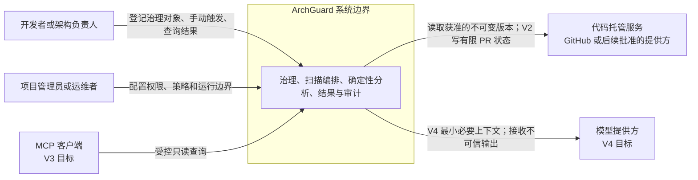

# ArchGuard 系统上下文与信任边界

- 状态：Accepted
- 切片：D07
- 适用范围：ArchGuard 系统边界、外部参与者、外部系统和一级信任边界
- 所有者：ArchGuard 项目所有者
- 依赖决策：D01–D06 与 G1 产品边界评审
- 最后评审：2026-09-09（G2 架构边界评审通过）
- 取代/被取代：无

## 本文解决的问题

本文只回答谁使用 ArchGuard、哪些外部系统与其交换什么信息，以及数据跨越哪些一级信任边界。容器和进程分工由 D08 定义，七仓库依赖由 D09 定义，Scanner 内部结构由 D10 定义；字段级语义、Rule 所有权和安全默认值由已接受的 D11–D13 定义。

## 当前事实

- 当前只完成治理与文档基线，没有可运行的 Platform、Scanner、Gateway 或 Analyzer。
- V1 聚焦 Java/Spring 的手动治理闭环；PR、MCP 和 AI 分别属于 V2、V3 和 V4。
- 目标 Repository 及其中的源码、配置、构建文件和文档均是不可信输入。
- GitHub 是已规划的代码托管和 V2 PR 集成对象，但本文不把 V1 输入限定为 GitHub。
- 模型提供方只在 V4 目标中出现，不参与确定性 Fact、Rule 或 Finding 的形成。

## 系统上下文

图中 V2–V4 交互表达预留边界，不表示当前已支持，也不把后续版本带入 V1 发布范围。

## 参与者与责任

| 参与者 | 目标 | 可执行操作 | 不授予的能力 |
|---|---|---|---|
| 开发者或架构负责人 | 管理 Repository、运行 Scan、查看可验证结果 | 在获准 Project 范围内读写治理对象并手动触发 Scan | 跨 Project 访问、任意目标代码执行、默认修改 Repository |
| 项目管理员 | 管理成员、Policy 和 Repository 归属 | 在明确治理范围内配置权限和策略 | 绕过资源归属、查看凭据或未授权源码 |
| 运维者 | 部署、观察、恢复 ArchGuard | 管理制品、配置、Secret 引用、备份和告警 | 通过日志或备份扩大源码和凭据可见范围 |
| MCP 客户端 | 在 V3 查询获准上下文 | 调用窄、版本化、默认只读的工具 | 直连数据库、任意 Shell、隐式写操作 |

人的身份可以重叠，但授权必须按当前动作、Project 和资源归属计算，不能因“管理员”或“运维者”称谓获得无边界访问。

## 外部系统边界

| 外部系统 | ArchGuard 使用方式 | 输入信任级别 | 输出与权限边界 |
|---|---|---|---|
| 代码托管服务 | 获取已授权 Repository 的明确版本；V2 接收 Webhook 并写有限状态或评论 | Repository 内容、元数据和 Webhook 载荷均不可信 | 使用最小权限和短期凭据；V1 不执行构建、插件、任务或脚本 |
| 身份提供方 | 后续可提供认证声明 | 声明需验证签名、受众、签发方和时效 | Platform 仍负责 Project 与资源级授权，不把认证等同于授权 |
| MCP 客户端 | V3 提交工具调用并接收受控结果 | 参数、会话和上游模型内容均不可信 | Gateway 校验 Schema、身份、范围、限流和审计，默认只读 |
| 模型提供方 | V4 接收最小化、经授权的证据上下文并返回解释 | 返回内容是不可信输入 | 结果须经 Schema、权限和业务校验；不能生成确定性 Finding |
| 可观测与 Secret 基础设施 | 接收指标/日志或提供运行凭据 | 外部服务故障或配置错误不可扩大权限 | 不发送完整源码、Token 或隐藏推理；Secret 不进入 Git 和镜像 |

身份提供方、模型提供方和独立可观测服务是否实际引入，仍需对应版本的设计与部署证据；它们不是 V1 必需容器。

## 一级信任边界

| 边界 | 跨越的数据 | 必须保持的不变量 | 后续冻结位置 |
|---|---|---|---|
| 用户/客户端 → ArchGuard | 身份、请求、筛选和配置 | 先认证授权，再校验输入；所有动作绑定 trace 和治理范围 | REST/MCP 契约与授权设计 |
| ArchGuard → 代码托管服务 | Repository 定位、不可变版本、短期访问能力 | 只访问获准版本；不持久化长期 Token；不执行目标代码 | D13 不可信输入安全与集成设计 |
| Platform → Scanner | Scan 输入引用、Policy 快照、限制和返回结果 | 使用独立版本化契约；Scanner 不接收 Platform 内部模型或数据库权限 | D08、D10 与 D11 扫描契约 |
| Scanner runtime → Analyzer | 规范化工作区、能力选择、配置、预算和取消 | Analyzer 不获得业务凭据、网络默认权限或 Registry 控制权 | D10 与 D13 执行安全 |
| ArchGuard → 模型提供方 | 最小证据、指令和输出 Schema | 发送前授权与最小化；返回后视为不可信并校验 | V4 Feature Spec、AI ADR 与 Evals |
| ArchGuard → 日志/指标/备份 | 摘要、标识、状态和运行证据 | 不记录凭据和完整源码；保留与删除策略一致 | D13 与运行手册 |

## 数据分类与责任

| 数据类别 | 例子 | 系统责任 | 默认保留方向 |
|---|---|---|---|
| 业务事实 | Project、Repository、Policy、Scan 状态、审计记录 | Platform 是事实来源并实施资源归属 | 由产品和合规需求定义生命周期，删除须可审计 |
| 分析结果 | Fact、Finding、Evidence、Diagnostic、版本摘要 | Scanner 产生，Platform 仅在契约校验后持久化所需部分 | 与 Scan 和 Repository 生命周期关联 |
| 源码与工作区 | Java 源码、POM、配置、临时检出 | Scanner 仅按最小需要临时处理 | 正常立即清理；失败后隔离并在 24 小时内补偿清理 |
| 凭据 | 登录会话、Repository 访问能力、服务 Secret | 身份/Secret 基础设施签发，使用方最小化持有 | 不进入结果、日志、代码库或长期扫描记录 |
| 模型上下文与输出 | V4 证据摘要、解释和建议 | Platform 在授权与 Schema 校验后使用 | 不默认发送完整源码；提供方保留策略须在启用前评审 |
| 遥测与备份 | traceId、指标、审计摘要、数据库备份 | Platform/Deploy 按用途采集和保护 | 按数据分类设置保留；删除不能破坏必要审计链 |

D13 已冻结 Repository 工作区的正常立即清理和失败后 24 小时补偿上限。D14 明确不虚构 Platform 结果、安全审计、模型数据和备份的具体保留时长；它们须由 M11 运行规范基于合规和产品证据决定。

## 已接受决策

- ArchGuard 是治理控制面与受控分析执行面的组合，不把代码托管、身份、模型或可观测供应商纳入自身系统边界。
- Platform 是所有业务身份、归属、策略、任务和持久化结果的授权入口。
- Scanner 与 Analyzer 不信任 Repository 内容，也不因扫描请求获得跨 Project 或业务数据库访问。
- 确定性结果不依赖模型提供方；模型不可成为 Rule 执行或发布门禁的唯一事实来源。
- V1 对外只需要 Platform 入口；Scanner、数据库和后续内部服务不暴露公网。

以上边界已于 2026-09-09 通过 G2 评审；具体机制仍按本文指定的后续切片冻结。

## 非目标

- 不定义 REST、ScanResult、MCP Tool 或模型输出的字段和错误码。
- 不选择认证供应商、Git 凭据实现、消息中间件、模型或可观测厂商。
- 不声明 V2–V4 能力已实现，也不把 GitHub PR、MCP 或 AI 纳入 V1。
- 不决定 Rule Executor 最终位于 Scanner runtime 还是 Analyzer 内部。
- 不给尚无证据的数据保留期、容量或公开 SLA 填写数值。

## 开放问题

- V1 生产输入已由 D14 选择 `content-archive`；`git-commit` 与 `managed-directory` 不能在没有新评审时标记为 V1 已支持。
- D14 已冻结七类公共 Fact；引用项之外的默认导出集合由 M4 Schema 和性能基线决定。
- Platform 结果、安全审计、模型数据和备份的具体保留与删除时限是什么？由 M11 运行规范决定。
- V4 是否允许任何源码片段离开部署边界？须由独立产品和安全评审决定。

## 验收证据

- 图中包含主要用户、代码托管服务、V3 MCP 客户端、V4 模型提供方和 ArchGuard 系统边界。
- 每条外部数据交换均标出信任、授权或最小化约束。
- 数据分类覆盖业务事实、分析结果、源码、凭据、模型数据和运行证据，并为后续决策指定所有者。
- [G1 产品边界评审](../reports/g1-product-boundary-review.md)支持本文的版本范围和非目标。
- [G2 架构边界评审](../reports/g2-architecture-boundary-review.md)接受本文的系统和信任边界。
- [安全与可观测规范](../engineering/security-and-observability.md)提供凭据、源码、授权和日志基线。
