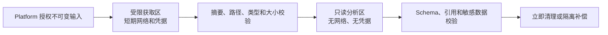

# 不可信 Repository 安全默认值

- 状态：Accepted
- 切片：D13
- 适用范围：Repository 输入获取、文件系统、进程、网络、凭据、输出、清理和保留
- 所有者：ArchGuard 项目所有者；Scanner/Platform/Deploy 分别实现所属控制
- 依赖决策：D07 信任边界、D08 容器架构、D10 Analyzer 架构、D11–D12 契约
- 最后评审：2026-09-09（G3 契约与安全评审通过）
- 取代/被取代：无

## 本文解决的问题

本文为 V1 扫描不可信 Repository 冻结默认拒绝的安全行为和责任边界。任何放宽都必须由 Capability 声明、威胁评审、ADR 和自动化安全测试共同批准，不能由 Repository 内容或单次请求启用。

## 当前事实

- 当前没有输入获取、临时工作区、容器、凭据注入、清理任务或安全测试实现。
- V1 明确不执行目标构建、脚本、插件、任务或任意命令。
- Scanner 与 Platform 是独立进程；Analyzer 与 Scanner 在 V1 同进程，但 Analyzer 默认无网络和凭据。
- D14 已选择 `content-archive` 作为 V1 唯一生产输入；本设计仍覆盖 Git、归档和受管目录的安全边界，但未启用的适配器不得获得部署权限。

## 受保护资产与主要威胁

| 资产 | 主要威胁 |
|---|---|
| Repository 源码与配置 | 越权读取、日志/错误泄漏、临时目录残留、跨 Project 串读 |
| Repository 访问能力 | Token 写盘、日志泄漏、跨任务复用、重定向到攻击者主机 |
| Scanner 主机和运行身份 | 命令执行、解析器漏洞、路径逃逸、设备文件、资源耗尽 |
| Platform 业务数据 | Scanner/Gateway 越权直连数据库、伪造 scanId 或迟到结果覆盖 |
| 结果和审计 | Schema 绕过、悬空/伪造 Evidence、绝对路径或源码进入日志 |
| 供应链 | Repository 动态插件、Git hooks/filters、恶意归档、未锁定 Scanner 依赖 |

## 默认拒绝矩阵

| 能力 | V1 默认 | 唯一允许路径 |
|---|---|---|
| 构建、测试、脚本、插件或任务执行 | 禁止 | V1 无例外；未来须新产品决策和安全 ADR |
| Repository 提供 Analyzer/JAR/classpath/native binary | 禁止 | Analyzer 只能随签名/受控 Scanner 制品发布 |
| Analyzer 网络访问 | 禁止 | 未来 Capability 显式声明、出站代理和安全测试后按目标放行 |
| Scanner 输入获取网络 | 默认禁止 | 仅获取阶段访问配置 allowlist 的提供方和端口 |
| 子模块、Git LFS、smudge/clean filter、hooks、fsmonitor | 禁止自动执行 | 只把其声明当作普通不可信文本；缺失内容产生 Diagnostic |
| 符号链接、junction、reparse point、硬链接逃逸 | 禁止 | 只读取解析后仍位于任务根的普通文件 |
| 主机路径、Docker socket、数据库和云实例元数据 | 禁止 | 无 V1 例外 |
| 源码片段进入结果、日志或指标 | 禁止 | D12 `0.1.0` 无 excerpt；未来须字段级数据评审 |
| 未声明字段、枚举、Rule 或参数 | 拒绝 | 只接受已协商 Schema 和 Registry allowlist |

## 身份、授权和输入引用

- Platform 在创建 Scan 和每次执行前校验 actor、Project、Repository、不可变 revision 和当前资源归属。
- Scanner 服务身份只允许调用其私有入口，不代表最终用户；Platform 不能用服务身份绕过业务授权。
- D11 请求只携带无密钥 `InputReference`。Token、SSH key、Cookie、签名 URL 查询串和云凭据不得进入 JSON。
- 私有 Repository 凭据由运行环境或受控凭据适配器按 `scanId/requestId` 临时注入，仅授予读取目标不可变 revision 的权限。
- 凭据在输入获取完成后立即从内存引用和子进程环境中撤销；不写磁盘、命令行、异常、结果或日志。
- 重定向必须重新执行 scheme/host/port allowlist；禁止重定向到 loopback、link-local、私有网段、云元数据或非批准域名。

## Git 输入安全

- 只接受 Platform 已解析并授权的完整 commit object ID，不接受分支、标签、默认分支或 PR 名称作为执行时 revision。
- 使用参数数组或受控 Git 库，不拼接 Shell；Repository 不能控制命令选项、工作目录或环境变量。
- 禁用 hooks、全局/系统 Repository 配置继承、外部 diff/merge、credential helper 回调、fsmonitor、submodule 递归和所有 filter process。
- 默认跳过 Git LFS 内容下载与 submodule 初始化，并返回能力/输入 Diagnostic，不执行仓库声明的外部程序。
- 克隆/获取目标必须经过 allowlist 和 DNS/IP 校验；输入完成后分析阶段撤销网络和凭据。
- checkout 后重新验证文件类型、规范路径和根目录约束，不能信任 Git tree 名称已经安全。

## 归档和受管目录安全

- archive 必须先验证 D11 SHA-256，再在新建的空任务目录中流式展开；摘要不匹配为不可重试安全失败。
- 展开前后同时应用压缩大小、展开总量、文件数、单文件大小、目录深度和压缩比硬上限。
- 拒绝绝对路径、`..`、空段、NUL、盘符、UNC、alternate data stream、设备名及规范化后碰撞。
- 拒绝或不跟随 symlink、hardlink、junction、reparse point、FIFO、socket、device 和其他非普通文件。
- `managed-directory` 必须由 ArchGuard 工作区管理器分配，不接受请求提供的主机绝对路径；使用前验证所有权、任务绑定和 digest。
- 文件名先按 Unicode 规范策略和目标文件系统大小写规则检测冲突；冲突时失败，不静默覆盖。

## 工作区与文件读取

- 每个 `requestId` 使用不可预测的新目录和独立 OS 身份/容器边界；禁止复用前一任务工作区。
- 输入验证完成后切换为只读；Scanner 输出、缓存和临时文件位于独立有界目录，不能写入 Repository 树。
- 只读取普通文件。二进制、不支持编码、超大文件或权限变化产生 Diagnostic，不尝试执行或“修复”。
- 路径在打开前和打开后都验证根目录归属，降低检查与使用时间差；解析时不跟随根外链接。
- 发现安全边界违反时停止受影响 Capability；可能污染整个输入时总体状态为 `FAILED`。

## 进程与系统控制

- Scanner 镜像/进程使用非 root、最小文件权限、只读根文件系统、无特权模式、无 Docker/容器运行时 socket。
- V1 Analyzer 与 Scanner 同进程，不允许启动 Repository 指定的子进程、Shell、构建工具、编译器、包管理器或脚本解释器。
- 运行环境限制 CPU、内存、进程/线程、打开文件、临时磁盘、执行时间和输出；限制必须有限且由 Deploy 固定。
- D11 的调用限制只能收紧部署硬上限。生产环境缺少任一必需上限时 readiness 失败，不能使用“无限”默认值。
- 超时或取消后停止 Analyzer、关闭文件、撤销凭据、禁用网络并进入清理；不得让后台线程继续读取工作区。
- Parser/Scanner 依赖锁定版本并进入 SCA、签名/来源验证和高危漏洞门禁。

## 网络与 SSRF 控制

| 阶段 | 网络策略 |
|---|---|
| 请求校验 | 无 Repository 网络；只校验 Schema、身份和本地配置 |
| 输入获取 | 仅允许配置的 HTTPS/SSH 提供方、固定端口和受控 DNS；拒绝 IP literal 与保留/私有地址 |
| 输入验证和分析 | 默认完全无出站网络；Analyzer 无网络 API 或代理凭据 |
| 结果提交 | Scanner 只通过预配置私有通道回复 Platform，不由 Repository 决定目标 |
| 清理 | 无外部网络；补偿任务只操作受管工作区和指标/审计通道 |

DNS 每次连接前解析并校验全部地址，连接目标必须与已校验地址一致；重定向、代理和 DNS rebinding 不能绕过 allowlist。

## 输出、日志和审计

- Scanner 和 Platform 分别按 D11/D12 Schema 校验；未知字段、绝对路径、悬空引用或身份冲突导致拒绝。
- Evidence 只包含规范相对路径、位置、符号和摘要；Diagnostic message 使用稳定模板和白名单参数。
- 日志记录 traceId、scanId、requestId、版本、状态、错误码、计数、耗时和资源摘要，不记录源码、Token、签名 URL、完整 Git remote 或环境变量。
- 审计记录授权主体、Repository 业务引用、不可变 revision、请求摘要、Scanner/Analyzer/Rule 版本、清理结果和安全拒绝。
- metrics 标签禁止使用路径、symbol、Repository URL、用户输入和其他高基数字段。

## 清理、保留和删除责任

| 数据 | 正常路径 | 异常路径 | 所有者 |
|---|---|---|---|
| 输入凭据 | 获取完成立即撤销，不落盘 | 获取失败/取消立即撤销并审计 | 输入适配器与 Deploy |
| Repository 工作区 | 结果校验后、返回终态前立即递归删除 | 移入仅运维可访问的隔离区并由补偿任务重试 | Scanner runtime |
| Analyzer 临时文件/缓存 | 与工作区同次清理 | 同工作区隔离，禁止其他任务复用 | Scanner runtime |
| Finding/引用 Fact/Evidence/Diagnostic | 按 Platform Scan 生命周期持久化 | 删除/保留由 Platform 审计用例处理 | Platform；具体产品时长由 M11 运行规范 |
| 安全审计 | 不包含源码，独立于工作区 | 保留清理失败和人工处置链 | Platform/Deploy；时长由运行规范 |

- 隔离区数据的补偿清理截止时间为首次失败后 24 小时；超期触发安全告警、停止受影响 worker 接收新任务并进入人工 Runbook。
- 隔离区使用独立权限和容量，不能被 Scanner、Analyzer 或其他 Scan 读取；不得把“用于调试”作为延长保留的默认理由。
- 所有成功、失败、取消、超时、进程崩溃和主机重启路径都必须有可验证清理测试。
- 清理失败但业务输出通过校验时按 D11 返回 `PARTIAL`；输出无法证明未受残留/污染影响时返回 `FAILED`。

## 安全失败与重试

| 类别 | 默认 retryable | 行为 |
|---|---:|---|
| 无权限、revision/digest 不匹配、路径逃逸、动态插件或命令请求 | 否 | `FAILED`，清理并审计安全拒绝 |
| 输入提供方暂时不可达/限流 | 是 | 有界重试，复用相同 requestId；不得扩大目标范围 |
| Parser 对单文件不支持 | 否 | Diagnostic；按 D11/D12 判断 Capability 是否 PARTIAL |
| Scanner 超时、取消或资源超限 | 否 | 停止执行；取消结果不输出业务结论，资源超限只保留 D11 允许的独立完整输出；随后清理工作区 |
| 清理暂时失败 | 是，仅补偿任务 | 结果不能标记为完全成功；隔离并在 24 小时内处理 |
| 输出 Schema/身份/引用无效 | 否 | 丢弃业务结果并 `FAILED`，记录提供方缺陷 |

## 验证门禁

- 路径穿越、symlink/junction/hardlink、大小写/Unicode 碰撞、Zip Slip、压缩炸弹和特殊文件测试。
- Git hooks、filters、LFS、submodule、恶意选项、重定向、DNS rebinding、SSRF 和云元数据阻断测试。
- 无网络 Analyzer、非 root、无 socket、无目标命令执行及资源超限测试。
- Token/源码/绝对路径日志和结果扫描；Schema、身份和引用负例测试。
- 成功、失败、取消、超时、崩溃、重启和清理失败补偿测试。
- 两个并发 Scan 互不可读写，迟到结果不能覆盖当前 Platform 状态。

## 兼容、发布和回滚

先接受安全 ADR 和 D11–D13，再发布 Scanner 安全实现与测试，随后 Platform 启用真实适配器，最后由 Deploy 固定硬上限、网络策略和兼容组合。放宽控制属于破坏性安全变化，必须新 ADR；回滚优先停止新 Scan、撤销输入凭据、回退 Platform adapter/Scanner 制品并完成所有残留工作区清理。

## 候选决策

- Repository 永远是不可信数据，V1 不执行其中的任何代码或构建行为。
- 获取阶段只有 allowlist 网络和短期凭据；分析阶段默认无网络、无凭据、只读输入。
- 生产 Scanner 缺少有限资源硬上限时拒绝就绪，请求只能收紧上限。
- Evidence `0.1.0` 不含源码片段，日志不含源码、凭据或主机绝对路径。
- 工作区正常立即清理；清理失败隔离并须在 24 小时内补偿，超期升级安全事件。

以上安全默认值已于 2026-09-09 通过 G3 评审。

## 非目标

- 不选择 Git 库、容器运行时、Sandbox 产品、Secret Manager、SCA 或日志厂商。
- 不给 CPU、内存、文件数和字节数虚构无基准数值；缺省时生产拒绝就绪。
- 不定义 Platform 业务结果和审计的产品保留时长，该值由 M11 运行规范决定。
- 不为 V1 提供构建沙箱、动态插件、远程 Analyzer 或任意 Shell。

## 开放问题

- M5/Deploy 必须只为 D14 启用的 `content-archive` 适配器提供部署权限，并用测试证明 Git/受管目录路径未开启。
- M4 基线必须给出所有 D11 `ExecutionLimits` 的初始值和安全余量。
- M5 Runbook 必须实现并演练 24 小时清理补偿与 worker 隔离流程。

## 验收证据

- 输入、路径、进程、网络、凭据、输出、清理和保留均有默认拒绝规则与所有者。
- [Scanner 契约](scan-contract.md)不携带凭据，[结果模型](result-rule-model.md)不携带源码 excerpt。
- [ADR-0003](../adr/0003-untrusted-repository-default-deny.md)记录默认拒绝选择。
